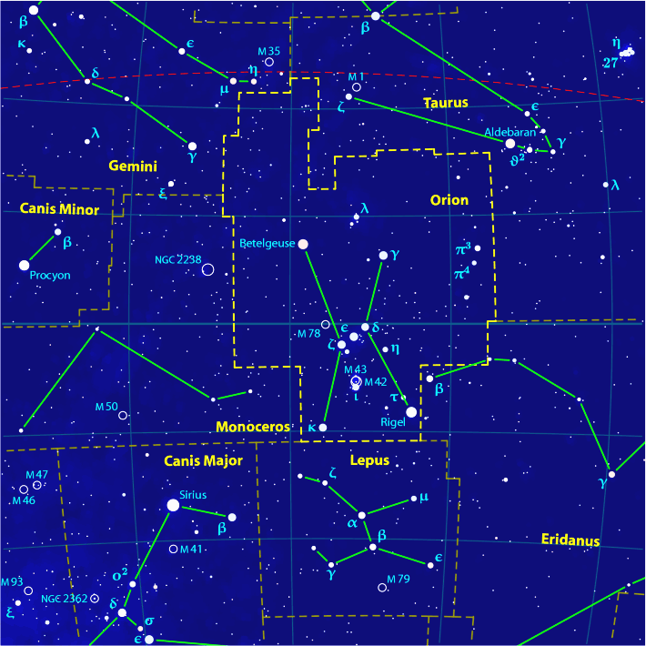
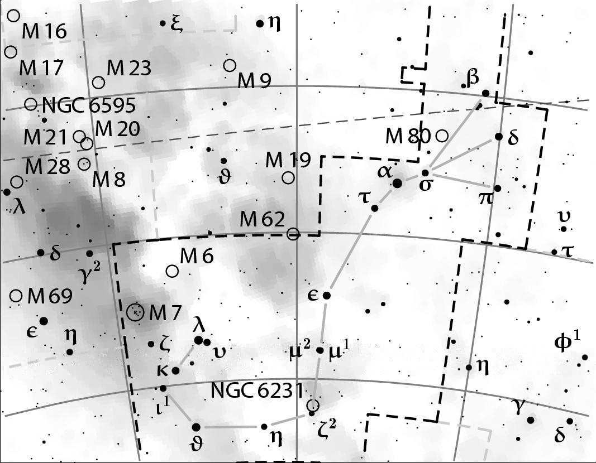

# PP3 - Celestial Chart Generation

PP3 creates celestial charts. It generates resolution independent maps of very high graphical quality. They can be used for example as illustrations in books or on web pages. You may use own databases or free ones from the Internet.

PP3 was developed by [Torsten Bronger](https://pp3.sourceforge.net/). The last version was 1.3.3 from 2004. 

I just provide a version which is compatible with modern C++ compilers and ready-2-use installers for current [GNU/Linux](https://blog.hani-ibrahim.de/en/pp3-ubuntu.html), [macOS](https://blog.hani-ibrahim.de/en/pp3-macos.html) and [Windows]([Release v1.3.5 · haniibrahim/pp3 · GitHub](https://github.com/haniibrahim/pp3/releases/tag/v1.3.5)). Please do not ask me for enhancements. I am not a C++ developer. I originally created this solely for my own use.

## Prerequisites

PP3 creates a LaTeX file. Apparently you cannot directly do something with it. So you  have to have a TeX suite installed in the first place. Otherwise PP3 will not function.

### TeX Package

For **Windows**, you may want to use the [MikTeX](http://www.miktex.org), or the [TeX Live](http://www.tug.org/texlive/) distribution. 

For **GNU/Linux**, it is either already installed or you can easily install it with your package manager. On Debian or Ubuntu systems and derivatives you need the packages `texlive` and `texlive-pstricks`. 

At **macOS** you can install [MacTeX](https://www.tug.org/mactex/). 

*Please be advised that these packages can occupy a lot of space on your disc.*

This enables you to use two important commands:

* latex for transforming the .tex file to a .dvi file.

* dvips for transforming the .dvi file to a Postscript or EPS file.

## Build & Basic Manual Installation

1. Download the latest version or clone it

2. Extract the archive if necessary

### Unix (GNU/Linux & macOS)

1. Open the terminal.

2. Change directory to the root of PP3 where the `Makefile` is located.
   E.g.: `cd ~/Download/pp3`

3. Type the command `make`. This should run without errors. A new executable file named `pp3` should have been created. PP3 is compiled now.

4. Move the `pp3` executable to the `/usr/local/bin/` directory:  
   `sudo mv pp3 /usr/local/bin/`

5. Create the directory `/usr/local/share/pp3`:  
   `sudo mkdir /usr/local/share/pp3`

6. Move the data files with the extension `*.dat` into the new directory:  
   `sudo mv *.dat /usr/local/share/pp3/`

7. PP3 is now installed.

### Windows

1. Open the Powershell or CMD.EXE

2. Change directory to the root of PP3 where the `Makefile` is located: 
   E.g.: `cd %USERPROFILE%\Download\pp3`

3. Type the command `make -f makefile.win.mak`. This should run without errors. A new executable file named `pp3` should have been created. PP3 is compiled now.

4. Move the whole pp3-directory to  `C:\` → `C:\pp3`. **Do not install it anywhere else!**

5. Add `C:\pp3` to  PATH environment variable ([How to Edit the PATH Environment Variable on Windows 11 & 10](https://www.wikihow.com/Change-the-PATH-Environment-Variable-on-Windows)).

6. PP3 is now installed.

### Documentation

Documentation, manuals in PDF & HTML is in the `doc` directory, examples in the `examples` directory.

## Examples

### Orion



```bash
# File: orion_color.pp3
# Chart of the Orion, color (EPS-output)
filename output ori.tex
switch eps_output on # EPS output

objects_and_labels

delete NGC 1973  NGC 1975 ;
reposition ORI 34 E ;    # Mintaka
reposition ORI 50 W ;    # Alnitak### Viewer
```

```bash
# Make chart
pp3 orion_color.pp3
```

### Scorpion



```bash
# File: scorpion_b&w.pp3
# Chart of the Scorpion, printable on a black
# and white printer (PDF-output)

set constellation SCO
set center_rectascension  17
set center_declination   -30
set grad_per_cm            4.5
set box_width              9
set box_height             7

switch milky_way on
switch pdf_output on # PDF output
switch colored_stars off
color stars 0 0 0
color nebulae 0 0 0
color background 1 1 1
color grid 0.5 0.5 0.5
color ecliptic 0.3 0.3 0.3
color constellation_lines 0.7 0.7 0.7
color labels 0 0 0
color boundaries 0.8 0.8 0.8
color highlighted_boundaries 0 0 0
color milky_way 0.5 0.5 0.5

filename output sco.tex

objects_and_labels

delete M 18  M 4  NGC 6590  NGC 6634  IC 4700 ;
reposition SCO 20 S ;    # sigma SCO
reposition M 23 NE ;
```

```bash
# Make Chart
pp3 scorpion_b&w.pp3
```

## Using Output Files

### For LaTeX

In general PP3 generates:

* LaTeX file (\*.tex) → LaTeX

* Device Independent DVI file (*.dvi)

* Encapsulated PostScript (EPS) file (*.eps) and

* PDFs are possible.

That's ideal for LaTeX.

### For Web, E-Mail

To view the **EPS file** on GNU/Linux had a viewer installed by default. For Windows I recommend [IrfanView](https://www.irfanview.com/). Since newer macOS version and its Preview.app do not support Postscript anymore, there are some commercial viewer on the App Store.

For viewing and converting on **all platforms** I recommend [Inkscape](https://inkscape.org/) or on the terminal for all platforms [Ghostscript](https://www.ghostscript.com/)

```bash
# Convert EPS to JPEG
gs -dNOPAUSE -dBATCH -dSAFER -sDEVICE=jpeg -sOutputFile=out.png in.eps
# Convert EPS to gray PNG with 300dpi 
gs -dNOPAUSE -dBATCH -dSAFER -sDEVICE=pnggray -r300 -sOutputFile=out_gray.png in.eps
# Convert EPS to color PNG with 300dpi
gs -dNOPAUSE -dBATCH -dSAFER -sDEVICE=png16m -r300 -sOutputFile=out_color.png in.eps
```

**PDF file** viewer are available by default on any platform.

### For Word Processors

Unfortunately current Microsoft Word or LibreOffice Writer do not support EPS files anymore. The best format for scalable graphics is SVG today.

The **best and most reliable way** to import celestial charts as scalable vector graphics from PP3:

1. Create PDF output with PP3 (`switch pdf_output on` in the input-file) from the beginning.

2. Convert it via [Inkscape](https://inkscape.org/) to SVG with the GUI-app or the CLI-app: 
   
   ```bash
   inkscape pp3_out.pdf --export-type=svg --export-filename=out.svg
   ```

In older Inscape version you may use: `inkscape --file=pp3-out.pdf --export-plain-svg=out.svg`.

Or **direct from EPS to SVG** (not tested):

If you have `pstoedit` with Ghostscript support installed you can do it in one command:

```pstoedit
pstoedit -f plot-svg pp3_out.eps out.svg
```

or depended on the `pstoedit` version:

```
pstoedit -f svg pp3_out.eps out.svg
```

## Disclaimer

PP3 is written primarily in C++. I am not a C++ developer and have no expertise in that language. I was able to update the code for modern compilers by simply Googling the error messages and warnings and using AI.

I am unable to add new features, expand the database, or fix serious bugs. I simply provide binary files and share them with those who are unable to compile the program themselves.

## License

[The MIT License (MIT)](https://mit-license.org/)

Copyright © 2026 

Permission is hereby granted, free of charge, to any person obtaining a copy of this software and associated documentation files (the “Software”), to deal in the Software without restriction, including without limitation the rights  to use, copy, modify, merge, publish, distribute, sublicense, and/or sell copies of the Software, and to permit ersons to whom the Software is furnished to do so, subject to the following conditions:

The above copyright notice and this permission notice shall be included in all copies or substantial portions of the Software.

THE SOFTWARE IS PROVIDED “AS IS”, WITHOUT WARRANTY OF ANY KIND, EXPRESS OR IMPLIED, INCLUDING BUT NOT LIMITED TO THE WARRANTIES OF MERCHANTABILITY, FITNESS FOR A PARTICULAR PURPOSE AND NONINFRINGEMENT. IN NO EVENT SHALL THE AUTHORS OR COPYRIGHT HOLDERS BE LIABLE FOR ANY CLAIM, DAMAGES OR OTHER  LIABILITY, WHETHER IN AN ACTION OF CONTRACT, TORT OR OTHERWISE,  RISING FROM,  OUT OF OR IN CONNECTION WITH THE SOFTWARE OR THE USE OR OTHER DEALINGS IN  THE SOFTWARE.
